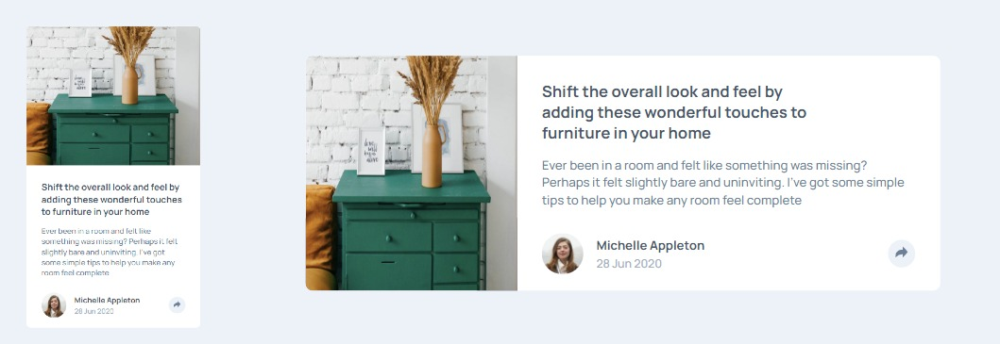

# Frontend Mentor - Article preview component solution

This is my solution to the [Article preview component challenge on Frontend Mentor](https://www.frontendmentor.io/challenges/article-preview-component-dYBN_pYFT)

## The challenge

Users should be able to:

- View the optimal layout for the component depending on their device's screen size
- See the social media share links when they click the share icon

## Links

- [Solution URL](https://github.com/okayda/react-article-preview.git)
- [Live Site URL](https://jhon-okayda-article-preview-component.netlify.app/)

## Built with

- React JS
- SCSS
- BEM

## Author

- Created by - okayda-jhon
